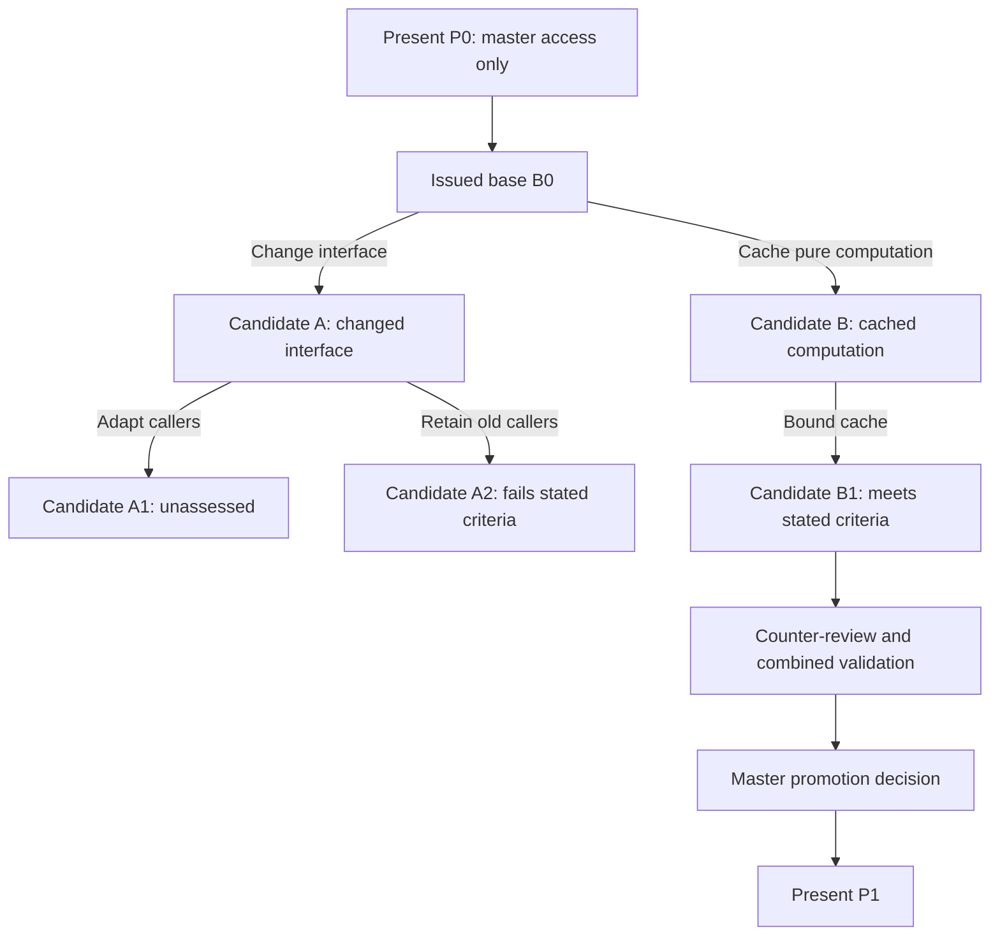
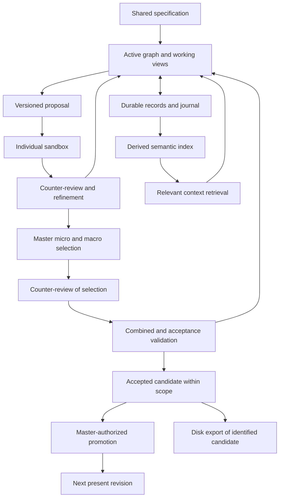

# Conceptual Architecture

Status: proposed responsibilities and invariants; implementation choices remain open.

Terminology follows [RARMURE Vocabulary](GLOSSARY.md). The present is a role-governed state, the code tree is a containment structure, and the exploration graph records alternative moves. They are not interchangeable objects.

## Intent before source code

Exploration can begin with requirements, intentions, hypotheses, and design alternatives before any source exists. Records must identify their kind: an **intent candidate** is an identified design state; a **code candidate** includes exact source. The code-oriented flows below apply once code candidates exist. A hypothetical design node is not an executable program or test evidence.

Create a code tree only when a bounded, usable implementation can be pursued against explicit criteria. The initial present may identify an adopted intent baseline without containing source code. When a first usable code candidate exists, its assessed state can be promoted by the master under the applicable mandate. No source hierarchy or application scaffolding is created merely to populate this concept.

## One project, coordinated representations

| Representation | Responsibility | Boundary |
| --- | --- | --- |
| Active graph in RAM | Fast traversal, working views, intentions, candidate changes, and interaction detection | Reconstructible; only the active working set must fit in memory |
| Durable database and journal | Exact code, identities, revisions, requirements, proposals, decisions, and evidence | Defines which revisions and changes have been durably recorded |
| Semantic retrieval index | Find related code, documents, intentions, and prior results | Derived and rebuildable; may temporarily lag current revisions |
| Filesystem projections and exports | Expose a fixed candidate to execution tools or deliver selected source files | A virtual mount need not copy all files to disk; each view identifies its exact input state |

The RAG process retrieves relevant context from an index and associated records. It is not a third independent authority over project content. Retrieval embeddings, exact source, and future model-internal representations are different objects.

## Present authority and virtual exploration

The **present** is the canonical project state designated by the current present revision. Among agents, only the master may directly read or write this tree. Workers and reviewers receive explicitly issued, revision-bound views; they do not receive a live alias to the present. The trusted runtime performs mechanical reads and promotion under that authority. Human inspection, export, and revocation remain available independently of the master's model.

Concurrent source construction takes place exclusively in the virtual graph in RAM. Workers develop working views derived from a base snapshot, register intentions, and propose transformations. Durable storage records that work for recovery; it does not become a second concurrent editing surface. Non-exclusive presence tags apply to exploration and do not grant access to the present.

| Surface | Master | Worker or reviewer | Execution process |
| --- | --- | --- | --- |
| Canonical present | Direct read and authorized promotion | No direct access | No direct access |
| Issued bases and candidate views | Inspect, coordinate, and select | Read within scope; propose successors | Read a pinned projection when assigned |
| Working views | Inspect and coordinate | Develop provisional changes within scope | No access to mutable validation inputs |
| Exploration paths and evidence | Coordinate and assess | Contribute within scope | Return attributed observations |
| Sandbox outputs | Inspect and associate with a candidate | Inspect through the assigned view | Write bounded temporary outputs |

Promotion advances an identified present revision to one exact selected candidate after applicable counter-review and combined validation. The runtime must check the expected present revision and active master authority, record the decision durably, and expose a coherent root transition. Interrupted promotion must be reconcilable. Competing or stale master instances must not both promote candidates; the concrete authority/fencing protocol remains open.

Advancing the present does not silently rebase active candidates or switch running sandbox mounts. Their original base remains identifiable. A candidate can be retained, explicitly rebased into a successor, or retired. Selection, promotion, deployment, and human acceptance remain separate states.

## Code structure and exploration paths

The code containment tree describes **what a particular program state contains**. A separate exploration structure describes **how that state could change over several moves**. A move is a proposed transformation, such as changing an interface, adapting callers, or introducing a cache. It is not a model token or necessarily a file edit.

Each exploration node identifies a candidate state, its requirement revision, assumptions, evidence, and permitted scope. Each edge records a transformation and its predecessor. An exploration path is an ordered sequence of these moves. An exploration fork introduces alternative continuations before any candidate is promoted. A proposed move can remain on the unexplored frontier without a resulting candidate yet.

The example describes hypothetical states, not observed results. A descendant may repair an invalid intermediate state, and an exploratory intermediate may not compile. An executable checkpoint requires a coherent manifest. A local failure therefore does not automatically invalidate every possible descendant; any pruning rule must state its scope and justification.

Paths may share immutable bases, reference common subresults, or combine through an explicit composition candidate. This can produce a directed acyclic graph of revision history rather than a strict tree; a repeated logical state is still represented without introducing cycles into ancestry. Similar vectors do not establish equivalent states. Equivalent source alone does not justify merging evidence when dependencies, requirements, or environments differ.

Search depth, branching width, active workers, RAM, model cost, and test time require budgets. The master can retain promising continuations, pause others, and promote a validated checkpoint while deeper exploration continues. No search algorithm, including beam search or Monte Carlo tree search, is selected. See [path assessment](REQUIREMENTS-AND-VALIDATION.md#path-assessment-and-search-state).

## Main flow

Feedback loops may occur at any stage. No direct provider response or retrieval result bypasses review and validation.

## Core objects

| Object | Minimum conceptual content |
| --- | --- |
| Requirement | Stable ID, statement, authority, priority class, criteria, conditions, and revision |
| Code element | Stable ID, exact content reference, revision, location, structure, and relationships |
| Document element | Stable ID, exact text or artifact reference, purpose, and revision |
| Intention | Agent identity, objective, relevant requirements, target IDs, assumptions, and current status |
| Proposal | Base revision, target elements, candidate transformation, dependencies, and expected effects |
| Working view | An authorized base snapshot plus evolving provisional changes |
| Candidate | A fixed proposed state with an immutable revision and explicit lineage |
| Candidate view | Scoped access to a fixed candidate and its associated context |
| Review | Reviewer identity, assessed revision, objections, evidence, and disposition |
| Experiment | Candidate manifest, environment, inputs, checks, limits, and observations |
| Decision | Selected alternatives, rationale, trade-offs, scope, authority, and supporting evidence |
| Materialization record | Exact input revisions, projected or exported files, transformation/tool versions, and content identities |

The graph includes containment, calls, dependencies, documentation, requirement coverage, review, and evidence relationships. Syntactic analysis can support some edges. Agent-inferred relationships must retain their uncertainty and provenance rather than masquerading as compiler facts.

Containment, authority, dependency, data ownership, and physical hosting are separate relation types. A code-tree view exposes containment; exploration and dependency views expose alternative moves and relationships crossing folders. The same pattern of bounded cooperation can recur at several scales without forcing every relationship into a hierarchy. See [SHAPER foundations](SHAPER-FOUNDATIONS.md).

## Semantic references

The reference model supports several levels of detail, as described below. A source location and an element's identity are separate properties.

A semantic reference identifies an element independently of its path and current name. Its identity resolves to exact content plus contextual relationships; descriptive meaning can evolve.

Reference identity and resolution mode are separate. Three conceptual resolution modes are useful:

- **Present:** resolve the current present revision; direct resolution is reserved to the master among agents.
- **Working view:** resolve a named authorized working view at an identified view version; it can contain provisional changes.
- **Fixed revision:** resolve an immutable object or candidate revision for reproducible reading or comparison.

Live intention and evidence updates are separate associated records. A fixed reference never silently follows the newest present or working-view version.

These are interface concepts, not implemented APIs. Stable identity across refactoring requires explicit policies. A rename or move can preserve identity; a split or merge may create successor relationships. Deletion must produce a visible unresolved or retired reference, not silent reassignment to a semantically similar element.

Vector search discovers likely relevant elements. Once selected, precise identity and revision establish what an agent reads or changes. A vector is not a lossless source-code serialization or a C memory address.

## Code structure at several resolutions

The working graph should support progressively finer views:

**Project → module or file → optional class or type → function or method → block → statement → expression → token.**

This is a navigation pattern rather than a universal grammar. Functions may be nested, methods may belong to different kinds of declarations, and some languages have no classes or explicit block delimiters. Language-specific adapters map their actual structure into common roles without discarding meaningful constructs.

Line-by-line inspection and editing remain available. A line is a location in an exact revision, not a stable semantic unit: one statement may span several lines, several statements may share a line, and formatting can change line positions without changing behavior.

| Level | Useful agent task | Context that must remain reachable |
| --- | --- | --- |
| Function or method | Change a behavior or implementation strategy | Signature, contract, callers, side effects and tests |
| Block | Improve a loop, conditional branch, transaction or error path | Enclosing control flow, variable scope and shared state |
| Statement or expression | Refine a predicate, assignment, call or calculation | Types, evaluation order, values read and effects produced |
| Token or line range | Apply a precise source edit or show a difference | The enclosing logical element and exact base revision |

Each managed element needs a durable object ID, kind, parent relation, exact source revision and span, plus its known dependencies. Presence, intentions, proposals, and evidence can attach at the level relevant to the work. A durable ID is not a parser node handle, line number, symbol name, or content hash. Matching identity across edits, moves, splits, and merges remains a separate policy; ambiguous matches must stay explicit.

The code tree preserves containment. Typed edges cross that tree to represent calls, reads and writes, data flow, requirement coverage, and evidence. Distinguish relationships established by parsing, language analysis, runtime observations, and agent inference. Syntax alone cannot establish every dependency, particularly with dynamic dispatch or generated code.

### Editing and impact scopes

An agent's edit scope may be one expression while its impact scope includes callers and a global requirement. Two agents changing different blocks in one method may cooperate without an ownership lock, but their edits can still interact through shared state or execution order. Conversely, a local edit need not trigger a discussion across the whole project when its relevant boundaries are known.

Use changed elements and their relationships to propose affected scopes, notify participants, and identify evidence to reconsider. Unknown dependencies should remain visible; an incomplete graph cannot justify declaring an edit independent. Parent summaries should point to the child revisions they summarize so stale summaries can be detected.

### Different units for storage and retrieval

Exact source remains reconstructible, including comments and formatting. A syntax tree and source spans provide navigable structure; they do not replace the original bytes. [Tree-sitter](https://tree-sitter.github.io/tree-sitter/using-parsers/2-basic-parsing.html) is a candidate parser that exposes syntax nodes and byte/line positions. Its [incremental parsing](https://tree-sitter.github.io/tree-sitter/using-parsers/3-advanced-parsing.html) can reuse prior tree structure after edits. Grammar coverage and identity tracking still need qualification.

The granularity of editing need not equal the granularity of vector indexing. Initially evaluate embeddings for coherent functions, methods, or meaningful blocks, linked to their exact revision and surrounding contract. Preserve statement and token access through the graph and source store without requiring an embedding for every line. Larger units can have derived summaries; smaller units can be indexed when retrieval evidence shows a benefit. Measure retrieval quality, update cost, and memory use before increasing density.

For example, an agent may refine a condition inside a method while another changes its caching block. The graph connects both proposals to the authorization requirement, their shared inputs, and a revocation test. They can work concurrently, then materialize and test the combined candidate. The unit of coordination follows the behavioral interaction, even when the textual edits do not overlap.

## Presence and concurrent editing

Multiple agents may analyze or propose modifications to the same object through their virtual working views. They do not concurrently edit the canonical present or a shared disk checkout. Presence records are non-exclusive and may expire when an agent stops reporting activity. Durable intentions and contribution history remain after transient presence expires.

Each proposal names its base revision and assumptions. Concurrent edits remain distinguishable until their compatibility is established. The future write protocol should check whether relevant source or dependencies changed before incorporating a proposal. A stale proposal must be reassessed or explicitly transformed against the newer state.

Avoiding ownership locks does not eliminate coordination. Short atomic state transitions may still be needed to record a coherent accepted state. Syntax-level merge success cannot establish behavioral compatibility, and disjoint files can still conflict through shared assumptions.

The precise claim is **concurrent exploration without ownership locks**. It is not a claim that the runtime is mutex-free, lock-free, or wait-free. Separate working views avoid long-lived exclusive reservations of code elements by agents. Internal structures, durable transactions, and coherent promotion still need a concrete synchronization protocol, which may use mutexes or other mechanisms. Exclusive master authority is an access rule, not a demonstrated concurrency progress guarantee.

## Durability and event delivery

The proposed persistence strategy is a durable change journal plus periodic state snapshots. Exact choices of transaction store, journal layout, and recovery machinery remain open.

A provisional change may appear in a working view immediately. It is reported as durable only after the relevant persistence acknowledgment. An acknowledged durable event can then drive projections and notifications. Recovery must rebuild a known state from snapshots and subsequent events.

The design needs event identities, per-object revision checks, duplicate handling, and catch-up after interruption. Indexing failure must not erase recorded code. Retry behavior must not apply a transformation twice. Presence refresh events can have weaker retention requirements than code or decisions.

Events should distinguish their actor, affected objects, base revisions, operation identity, attempt identity, correlation, and causal predecessor where known. Arrival order is not sufficient evidence of causality. A provider session, a logical collaboration session, an intended operation, and an execution attempt have different lifetimes. After an interrupted attempt, reconcile its durable record and actual effects before retrying; a timeout does not establish that nothing happened.

## Retrieval freshness and memory limits

Index entries should identify the object and revision represented. Before modifying an element discovered through retrieval, resolve its current or explicitly selected revision. A stale result may remain useful historically but must not be presented as current content.

Load active subgraphs and useful dependencies into RAM; retain the wider project durably. Shared bases with separate candidate changes may reduce duplication, but their actual memory benefit must be measured. Embeddings can update asynchronously while direct event notifications provide timely coordination.

Retrieval must enforce the requesting role's data boundary before returning content, including summaries and evidence sent to a model provider. Parent coordination does not imply unrestricted access to child data. Source text is contextual input, not a grant of instructions or permissions. Record missing or unavailable embeddings explicitly; exact and lexical retrieval must not be mislabeled semantic retrieval.

An existing file can be visible to the workspace, indexed for retrieval, or managed through the revision protocol. These states are distinct. Indexing a file alone does not make concurrent edits safe or bring external changes under RARMURE's control. The transition into managed state needs an identified baseline and an explicit path for subsequent external edits.

## Materialization and round trips

A sandbox receives a fixed candidate manifest, not a moving live target. It exposes the required source, dependencies, configuration, and tests. Results refer back to that manifest.

A FUSE-style filesystem is the proposed bridge between the virtual graph and ordinary build/test tools. [FUSE](https://www.kernel.org/doc/html/latest/filesystems/fuse/fuse.html) lets a userspace process provide file data and metadata through the operating system's filesystem interface. RARMURE could use this to expose a candidate on demand without first copying the entire code tree to disk. No FUSE implementation or Rust binding is selected.

Each mount must resolve to one pinned candidate manifest, with the dependencies needed by its test scope. A narrow code subtree alone may be insufficient to build or run. The candidate view is shared only with authorized participants; assigning a view does not reserve its underlying code elements against other exploration.

Source inputs should initially be read-only during validation, with build products and temporary files in a separate writable area. If ordinary editor or generator writes are supported later, they must enter a view-specific virtual change buffer and become an explicit successor candidate. They cannot mutate the pinned test inputs or the present. Scratch outputs on disk are execution artifacts, not the concurrent source-authoring medium.

A FUSE mount presents files; it does not itself provide the complete sandbox. Process, network, resource, and credential isolation require separate controls. Workers must have neither a mount nor an API credential that bypasses the present authority boundary. Agent IDs alone are not an operating-system access boundary. Filesystem semantics, cache behavior, rename handling, tool compatibility, and behavior after daemon failure require qualification.

Live exploration, a fixed candidate, a tested snapshot, a selected composition, and an accepted realization must remain distinguishable. The manifest should bind exact content identities, toolchain and dependency states. New tests add observations to an identified state; they do not turn a changing live view into a reproducible snapshot.

Any supported file-tool round trip must name its candidate base and return changes into the virtual graph as a proposal. A issued candidate, historical snapshot, or running test input must never change through that path. Unrecognized files and unsupported syntax need explicit handling.

Initially, exact stored source could be materialized in its original language. Translating a future intermediate representation into C, PHP, JavaScript/Node.js, Python, or other targets is separate research. No universal translator is specified or implemented here.

Git is not required as the live coordination mechanism. The system still needs revision identity, provenance, recovery, and compatibility checks. Optional export into an external version-control system is compatible with the concept.
