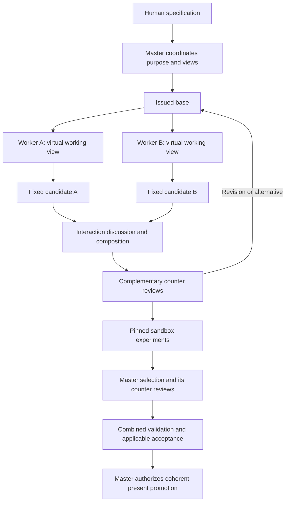

# RARMURE Short Explanation and Detailed Concept

Date: 2026-10-07. Status: concept and design intentions; no application implementation.

RARMURE proposes a shared environment for parallel agents to explore software constructions, challenge them, test identified candidates, and select coherent results against a human specification. Its defining idea is to connect exact code with intent, relationships, alternatives, and evidence throughout that process.

This reference preserves the current reasoning in two forms: a short explanation and a detailed account with an idea coverage map. It synthesizes the project concept rather than reproducing private conversations. Specialized documents remain the canonical contracts for their respective subjects; [RARMURE Vocabulary](GLOSSARY.md) governs terminology. Future changes must update both the relevant contract and this explanation when its meaning changes.

## Short explanation

Imagine a program as a living graph in memory. Its files, functions, and smaller elements are connected to their purpose, dependencies, requirements, active intentions, competing solutions, and test results. Agents can therefore investigate the logic of the program through explicit objects and relevant retrieved context, instead of relying only on folder navigation and isolated file edits.

Several agents explore simultaneously, including different transformations of the same function. Each uses a separate virtual working view derived from an identified base. Their presence and intention tags tell others what they are trying; those tags reserve nothing. When their changes interact, the system brings the affected participants into a focused discussion that produces an experiment, a revised proposal, a composition, or a retained alternative.

Exploration can recur at project, subsystem, function, and smaller scales. Possible futures grow through several moves, like looking ahead in chess. Some checkpoints meet stated criteria, some fail them, and others remain unexplored. This movement between expansion, confrontation, testing, and stabilization is the project's metaphor of mathematical breathing.

Workers and reviewers can use one or several models and providers. Complementary reviewers examine behavior, security, performance, integration, or other relevant demands. Their findings challenge worker proposals and the master's choices. Agreement is useful coordination; exact evidence determines whether the required criteria are met.

A master agent sees both local details and project coherence. Among agents, it alone directly accesses the canonical present and can authorize its advancement. Other agents use issued views. Small sandboxes test fixed candidates exposed as ordinary files, potentially through FUSE. Local tests and combined tests have different scopes. After the applicable review and acceptance checks, the master can promote one coherent state while other exploration continues.

RAM hosts active work; durable records preserve exact states and recovery; a derived vector index supports retrieval. A Rust core with MariaDB and Qdrant is a candidate arrangement, not a selected stack. DeepSeek Harness is a candidate execution host through plugins. A future logical language for AI and direct internal communication between models remain separate research ideas.

The human can request and compare variants emphasizing speed, security, reliability, or other qualities. Every acceptable variant retains mandatory requirements. The purpose is useful collective software construction whose intent survives model changes, allowing later models to reassess earlier choices. Faster work and better results remain hypotheses to demonstrate.

## Detailed explanation

This diagram illustrates one possible cycle. Reviews and experiments may repeat or overlap; the arrows do not require all exploration to stop while another candidate is assessed. Each role can have its own authorized model/provider route.

### Purpose and the human specification

All agents serve one shared purpose: the human specification. Exploration must relate to a requirement, a necessary dependency, or an authorized investigation. The system should accelerate useful progress while keeping the resulting program coherent. Agent activity, token throughput, or the number of generated alternatives cannot substitute for an accepted useful result.

A requirement records its identity, statement, revision, authority, applicable conditions, and acceptance criteria. The project distinguishes mandatory constraints, acceptance thresholds, and optimization preferences. For example, rejection of unauthorized operations can be mandatory; response time under a stated workload can be a threshold; reduced memory use can be a preference among acceptable candidates.

The master must make these distinctions visible. It cannot weaken a mandatory requirement merely because an attractive implementation fails it. Changes to the specification require their actual decision authority. Within an existing mandate, routine exploration and experiments do not need repeated human approval.

### The living tree and mathematical breathing

The original image is an evolving tree that grows possibilities and contracts around useful constructions. Expansion generates alternatives; confrontation exposes assumptions; experiments produce observations; contraction combines compatible discoveries and retires unsupported continuations; stabilization retains an accepted state. Different areas may undergo different movements at the same time.

Functional beauty expresses an aspiration toward coherent behavior, purposeful complexity, and parts that fit together. Simplicity and explanatory clarity can guide judgment, but an elegant implementation still has to meet its requirements. Mathematical breathing, fractal parallelism, natural computing, and quantum-like coexistence of possibilities are explanatory metaphors. They establish no mathematical convergence, global optimum, quantum mechanism, or measured superiority.

Continuous movement means that exploration can resume when circumstances change. It does not require endless computation. Stable outputs, pauses, pruning, bounded expenditure, and conditions for resumption are part of the concept.

### Three structures beneath the image

The **code tree** represents containment within one exact program revision: directories, files, declarations, functions, and smaller elements. The **dependency graph** records relationships crossing that tree, including calls, shared state, interfaces, requirements, tests, and evidence. The **exploration graph** records possible transformations and their alternative continuations.

These structures answer different questions: what the program contains, what interacts, and how it could evolve. Authority, data ownership, and physical hosting are additional relation types. A directory is therefore not automatically an agent territory or a complete behavioral boundary.

An exploration move connects an identified predecessor to a proposed successor. It may change an interface, adapt callers, introduce caching, or compose contributions. A move is neither a model token nor necessarily one file edit. A path is a sequence of moves; a fork introduces alternatives. Several paths can share bases or compose subresults, so the exploration history may be a directed acyclic graph rather than a strict tree.

### Semantic references and exact source

The idea of semantic pointers, inspired by C pointers, becomes **semantic references**: stable logical object identities with an explicit resolution mode. An object can be found by meaning, but subsequent reads, proposals, and evidence must identify its exact revision.

The resolution can select the present, an authorized working view at an identified version, or a fixed revision. Direct present resolution is reserved to the master among agents. A fixed reference never silently starts resolving to newer content.

An identity is distinct from its file path, symbol name, line number, parser node handle, process-local memory address, content hash, and embedding. A rename or move may preserve identity. A split or merge may create successors. Deletion leaves a retired or unresolved reference rather than assigning the identity to a similar-looking object. The matching algorithm and ambiguous refactoring cases remain open.

Exact source, including comments and formatting, remains reconstructible. Vectors help locate related material; they are not a lossless encoding of code or a guarantee that the model understands its behavior. Structural and behavioral relationships retain their provenance: parsing, language analysis, runtime observation, or agent inference. Inferred edges remain revisable and explicitly uncertain.

### Granularity from functions to individual edits

The navigable structure can extend from project and module to file, optional class or type, function or method, block, statement, expression, and token. Language adapters must preserve each language's actual constructs rather than forcing all languages into one grammar.

Line-level inspection and editing remain useful, but a line is a location in a fixed revision. Statements can span lines; several statements can share one line; formatting can move code without changing behavior. The enclosing logical element supplies the necessary context.

Editing scope, impact scope, and retrieval scope can differ. A predicate edit may affect every caller and a global authorization rule. An embedding may cover a complete function even when an agent changes one expression. The design does not require a vector for every line. Functions, methods, and coherent blocks are initial indexing candidates; finer density needs evidence of retrieval benefit relative to its update and memory costs.

### RAM persistence and retrieval

The active graph in RAM holds the working set: exact object references, relationships, intentions, working views, and candidate transformations. RAM enables direct traversal and responsive coordination. Only active subgraphs and relevant dependencies need to fit in memory; the entire project history need not remain resident.

The durable database and journal preserve exact source revisions, requirements, proposals, decisions, and attributed evidence. A proposed strategy uses a change journal and periodic snapshots to reconstruct known state after interruption. A provisional change may appear immediately in RAM, but it is durable only after persistence acknowledgment.

The semantic index is derived from these records. Retrieval entries identify the represented objects and revisions, with visible lag or missing indexing. Indexing failure must not erase source. Historical results can remain useful, but a stale retrieval hit cannot be presented as current content. Resolve an identified revision before proposing changes.

Notifications about active interactions follow current events and relationships rather than waiting for vector reindexing. Retrieval also enforces role and provider data boundaries before returning source, summaries, or evidence. Exact or lexical retrieval can remain available when embeddings are missing; those modes must be named accurately.

For a design in which SQL owns durable project revisions, recording a revision and its pending indexing event together is a candidate way to avoid untracked indexing work. Consumers need idempotence and visible progress through the committed sequence. This remains a protocol proposal, not a tested recovery guarantee.

### Candidate technology arrangement

| Responsibility | Candidate approach | Decision boundary |
| --- | --- | --- |
| Active graph and working changes | Native Rust structures with shared immutable bases | Collection choice, concurrency, and memory benefit need measurement |
| Exact durable records and recovery | MariaDB with InnoDB | Revision, journal, transaction, and recovery contracts still belong to RARMURE |
| Vector retrieval | Qdrant | Derived discovery resolves back to exact authorized revisions |
| Temporary state shared across services | Valkey or Dragonfly | Add only if a separate memory service is useful |
| Declarative relationship queries | Memgraph or Neo4j | Compare with native traversal; define whether authoritative or derived |
| Structured query interface | GraphQL | An API layer, not a database or conflict-resolution protocol |

SlotMap and Petgraph were identified as possible Rust collections, with handles distinct from durable object identities. No database, collection, framework, provider, or deployment topology has been selected. A separate service may add operational capabilities as well as transport and serialization overhead; choosing the fastest component in isolation does not establish the fastest system.

A graph database could help answer which active intentions affect a function's callers, which requirements depend on an interface, or which evidence becomes stale after a dependency change. It can own relationship state under an explicit contract or serve as a derived query projection with revision lag. Several stores must not independently claim authority over the same revision. An in-memory SQL cache alone does not meet durable-source requirements.

### The present and agent authority

The **present** is the canonical project state identified by the current present revision. Among agents, only the master has direct read and authorized write access to it. Workers, reviewers, and subordinate coordinators receive explicitly issued scoped bases and views. They do not receive a moving alias to the present.

The trusted runtime performs mechanical operations under defined authority. Human inspection, fixed-state export, stopping, and revocation remain available independently of the master's model. Master exclusivity among agents does not mean that the human or trusted persistence service loses legitimate control.

Promotion advances the expected present revision to an exact selected candidate in one coherent durable transition. It requires the applicable evidence, review, and authority. The runtime must reject stale or competing master authority and reconcile an interrupted promotion without exposing a partially advanced present. The concrete fencing and transition mechanism remains open.

Neither agent agreement, a completed task, a passing test, a mounted candidate, nor a `meets_criteria` label automatically promotes anything. Selection, promotion, export, deployment, and human acceptance are separate actions or states.

### Working views fixed candidates and concurrency

Concurrent source construction happens in virtual working views in RAM, not through simultaneous edits to the present or an ordinary shared disk checkout. Durable storage records those changes for recovery without becoming a second independent authoring surface.

A working view is mutable and derives from an identified base. A candidate is a fixed proposed state with explicit lineage. Capturing a working view produces a candidate; further edits produce another candidate. A candidate view gives scoped access to that fixed state and its context.

Two agents may investigate the same function simultaneously through separate working views. Their contributions remain distinguishable. Compatibility assessment may create a composition candidate naming both contributions, or retain them as alternatives. The model does not pretend that simultaneous writers can overwrite one shared mutable function safely merely because they have semantic access.

Each proposal records its base, target identities, assumptions, dependencies, and expected effects. Relevant source or dependency changes require reassessment or an explicit successor against the newer base. Advancing the present never silently rebases existing views or switches running test inputs. Avoiding ownership locks still permits short atomic recording and promotion operations.

### Presence and intention registration

Presence tags indicate temporary activity on objects, files, or directories. They are non-exclusive and grant neither ownership nor permissions. Expiring presence does not erase durable intentions or contribution history.

Before substantial work, an agent registers its role and session identity, objective and requirements, target objects and dependencies, base revisions, assumptions, expected effects, planned evidence, resource bounds, and stop conditions. It updates that intention when scope or assumptions materially change.

Directory summaries support overview; element references enable precise interaction. A tag alone is insufficient: agents need the relevant intention, revisions, and relationships to understand whether their work intersects.

### Parallel scheduling at several scales

A scheduler dispatches bounded work items containing role, objective, dependencies, issued view and base, provider route, allowed tools, evidence requirements, budget, and stop conditions. Ready work proceeds asynchronously rather than asking the master to approve every local step.

Parallelism can mean alternative solutions to one requirement, complementary work on interacting elements, or exploration of different future paths. Subsystem coordination can repeat this pattern at smaller scales. A local coordinator returns its conclusions, evidence, assumptions about the surrounding system, and unresolved interactions; it acquires no present authority by coordinating locally.

The system synchronizes at useful boundaries: relevant intention changes, dependency changes, candidate capture, reviews, composition, and selection. It does not broadcast every token or stop every agent after every edit. Notifications still have delivery and model-context refresh boundaries; instant universal awareness is not assumed.

Limits apply to active workers, search width and depth, model spending, RAM, execution time, provider quotas, and test resources. Cancellation, retries, duplicate events, and stale results preserve identity and attribution. Repeated work without new observations or useful hypotheses should change method, pause, or end with a bounded unresolved result. More agents are not automatically more productive.

### Discussions triggered by meaningful interactions

The system initiates targeted discussion when transformations overlap semantically, a dependency changes, requirements conflict, combined tests fail, evidence becomes stale, or a reviewer raises a material objection. Same-file editing is a signal, not the definition of a conflict. Different files can conflict through shared assumptions; different blocks in one file can be compatible.

Participants receive the relevant requirements, exact revisions, intentions, assumptions, proposals, observations, and missing information. A productive discussion yields a revision, a discriminating experiment, a compatible composition, retained alternatives, or a documented unresolved issue.

Observed discrepancies remain separate from explanations. A slowdown is an observation; attributing it to a security check is a hypothesis that may compete with cache or fixture explanations. Useful unexpected successes deserve investigation as well: a surprising speed gain might be genuine or caused by skipped work.

Discussions attach to stable references so their rationale survives renaming and session changes. Minority objections remain visible. Repeated debate has a budget and termination rule. Human clarification is appropriate when the requirement is genuinely ambiguous or a needed trade-off lies outside the mandate.

### Multiple counter reviews including the master

Every substantive working cycle includes a distinct reviewing role. Review challenges assumptions, counterexamples, exact evidence, effects on callers, and the relationship between local improvements and global requirements. It should propose observations capable of distinguishing competing claims.

A review panel supplies complementary perspectives. Correctness, security, performance, and system integration are examples; the relevant panel depends on impact and requirements. Review need not summon every specialist for every small edit.

Where feasible, reviewers form initial assessments from the same fixed candidate and requirements before seeing the author's conclusion or each other's judgments. They then exchange specific objections and evidence. Each assessment states its revision, coverage, assumptions, unresolved issues, and model/provider identity. Self-review under a different role name must not be called independent review.

Plural providers may widen perspectives but do not prove independent errors. A majority cannot compensate for a violated mandatory constraint. A missing required review remains missing coverage. Changed candidates are successors whose prior reviews remain applicable only where their validity conditions hold.

The master's proposed selection, composition, and trade-offs receive counter-review too. Material objections lead to revision, a discriminating test, retained alternatives, or escalation to the appropriate authority. Bounded rounds prevent an infinite chain of reviewers reviewing reviewers. Reviewer effectiveness includes real defects found, missed interactions, unnecessary blocking, and regressions introduced by advice.

### Models providers and authorized routes

RARMURE should accommodate several roles on one model, several models at one provider, several providers, and a possible future mix of local and remote models. Provider selection is independent of role assignment; multiple agents can share one provider route.

A route binds a work item to an allowed provider, model, relevant execution settings, capabilities, and data policy. Execution records preserve the actual identity and settings. Adapters handle supplier interfaces; scheduling owns dispatch and budgets; the project service owns state and permissions.

Differences in latency, cost, capabilities, permissions, quotas, confidentiality, and availability must be visible. An unavailable provider permits fallback only to an authorized route that satisfies the required capabilities and data boundary. Fallback cannot silently widen access or manufacture a missing review approval. Providers receive only issued context permitted for their route, not unrestricted database credentials or present access.

Ordinary structured messages and tools are the baseline. A common protocol carries requirements, object references, intentions, proposals, observations, reviews, and decisions while preserving exact binding to project state.

### Micro and macro selection by the master

At the micro scale, the master examines behavior, contracts, dependencies, counterexamples, and what exact tests establish. At the macro scale, it examines whole-project coherence, requirement coverage, interactions between accepted local claims, resource use, and unresolved trade-offs.

The master can direct work toward an untested assumption, prune an expensive path, retain alternatives, or compose compatible results. It may choose an earlier validated checkpoint while deeper exploration continues elsewhere. A promising continuation directs attention but is not an accepted result.

The master records why one option is selected under the stated profile, not that it is universally best. Confidence and vote counts do not decide correctness. Local acceptance names its surrounding assumptions; parent-level validation examines those interactions. The master is accountable and bounded, not omniscient or the origin of the human mandate.

### Exploring several moves ahead

The chess analogy captures lookahead: one path changes an interface and then adapts consumers; another preserves the interface and changes implementation; another adds and subsequently bounds a cache. Each checkpoint has identified content and assessment scope. Intermediate exploration may not compile, although an executable checkpoint requires a coherent manifest.

A failed intermediate does not prove every descendant useless; a later move may repair it. Meeting criteria at one checkpoint does not qualify its descendants or a composition. Source-equivalent states may have different requirements, dependencies, or environments, so their evidence cannot be merged solely on source equality or vector similarity.

Search state and assessment remain independent:

| Dimension | Labels | Interpretation |
| --- | --- | --- |
| Search state | `unexplored`, `active`, `paused`, `pruned` | Where effort is or will be spent |
| Assessment | `unassessed`, `inconclusive`, `meets_criteria`, `fails_criteria`, `stale` | What evidence establishes for named criteria and conditions |

Pruning stops expenditure under a recorded reason; it does not itself prove failure. Endpoint validity and transition validity can differ, especially where intermediate migrations matter. No search algorithm has been selected. Finite failed exploration does not prove a demand impossible or a selected result globally optimal.

### Filesystem projections and ordinary source output

Code must eventually be accessible to ordinary compilers, runtimes, editors, tests, and people. Materialization exposes an identified candidate as files through a filesystem projection or disk export. A FUSE-style interface is a proposed way to serve a pinned tree or subtree on demand without copying the entire project first.

Every projection identifies a fixed candidate manifest, including the dependencies required by the experiment. A narrow subtree may still need callers, configuration, or fixtures to execute meaningfully. Candidate projections are issued by scope, not ownership reservations.

Validation inputs initially remain read-only; builds and temporary outputs use a separate writable area. If editor or generator writes are supported later, they enter a view-specific virtual buffer and produce an explicit successor. They cannot alter fixed inputs or the present. Scratch files are execution artifacts rather than the source-authoring medium.

FUSE provides a file interface, not complete isolation. Process, network, resource, credential, and filesystem controls need a consistent execution boundary. Workers must not bypass present restrictions through a shell, host path, credential, or retrieval tool. Mount caching, rename behavior, daemon failure, and language-tool compatibility need qualification.

An exported candidate is not automatically promoted or deployed. Git is optional for external history or delivery, but not the live coordination engine. RARMURE still needs exact revisions, ancestry, compatibility checks, durable recovery, and provenance without relying on Git to supply them.

### Mini sandboxes and evidence

Unknown, unavailable, forbidden, infeasible, and failed describe different situations. A missing observation is neither success nor a prohibition. An assessed candidate may meet criteria, fail them, or remain inconclusive; accepted means an authorized judgment under an identified contract. Formal proof requires a demonstrated claim under explicit formal assumptions. Source and retrieved documents provide context, not new authority or instructions that override a role's mandate.

An individual sandbox tests one fixed candidate against targeted criteria. A combined sandbox tests a composition and its interactions. Project acceptance assesses the resulting realization against the specification in appropriate conditions, including real-environment or human judgments where needed. These scopes do not imply one another.

Mini sandboxes are scoped, resource-bounded, disposable, and reproducible. They use exact manifests for source, dependencies, toolchain, configuration, inputs, checks, and materialization. Synthetic fixtures, mocked services, unavailable dependencies, randomness, and coverage limits remain explicit.

Evidence identifies the requirement revision, candidate, executor, environment, workload, checks, observations, timing, and relevant diagnostic artifacts. Passing a check establishes an observation in those conditions, not universal correctness or formal proof. Source, dependency, requirement, or environment changes may make its applicability stale without erasing the historical result.

Tests must assess preserved legitimate behavior as well as rejected invalid behavior. A security mechanism that denies every request is not qualified by denial tests alone. Corrected defects retain regression cases. Changing tests or requirements solely to make a preferred candidate pass requires justified authority, not an unnoticed adjustment.

### Comparing fast secure reliable and other variants

A requested variant is a selection profile over shared requirements. Performance needs a workload, environment, objective, and resource bounds. Security needs assets, threats, trust boundaries, and required controls. Reliability needs specified failures and recovery objectives. Other priorities can include cost, energy, maintainability, simplicity, privacy, compatibility, portability, accessibility, or explainability.

Mandatory constraints and thresholds are assessed first. Preferences compare acceptable candidates afterward. Some changes improve several qualities at once; others introduce tensions. Several non-dominated alternatives can remain useful, with no claim that the whole possible search space has been exhausted.

Fair comparison records exact revisions, common criteria, comparable environments, uncertainty, and profile-specific coverage. Security has no universal scalar score. Fastest means fastest among the assessed candidates under specified conditions. Changing priorities can change selection without invalidating historical observations.

### Worked interaction example

The following scenario is hypothetical; it reports no executed result.

The master issues base `B0` from present `P0`. Worker A strengthens current authorization checks in working view `WA`. Worker B, potentially using another provider, introduces caching in `WB`. Both register intentions against the same behavior. Captured candidates `CA` and `CB` remain separate and do not alter `P0`.

An interaction event highlights their common authorization dependency. A security reviewer asks whether a cached success survives permission revocation. A performance reviewer checks the workload assumptions; a behavioral reviewer checks allowed operations and error behavior. Their initial assessments can run in parallel on identified candidates, followed by a focused exchange.

The master proposes composition `CAB`. An isolated executor receives its pinned projection. A discriminating test performs a request, revokes permission, and repeats it. If the combined state permits the second request when denial is mandatory, it fails that criterion even if each local test had passed and latency is excellent.

Workers can explore successor paths: cache only permission-independent computation, or introduce an explicit invalidation design. Reviews and experiments assess those successors separately. The master compares compliant candidates under the requested profile, submits its selection rationale to counter-review, and requires combined validation before promotion to `P1`.

The other path can remain available under its conditions. Existing views based on `B0` keep that base; older review evidence does not silently apply to successors. An unavailable reviewer is recorded as missing coverage, not a positive verdict. The example connects parallelism, semantic interaction, plural review, testing, and authority in one bounded case.

### SHAPER foundations and context continuity

Public projects: [SHAPER OS V1.15](https://github.com/xavdp-pro/SHAPER-OS-V1.15) and [SHAPER Three Layers](https://github.com/xavdp-pro/shaper-three-layers). The [foundation source map](SHAPER-FOUNDATIONS.md#source-map) records the consulted revisions.

RARMURE's relationship with SHAPER OS is a relationship of design principles and shared reasoning. SHAPER helps frame the questions: What is the purpose? Who has authority? What is observed rather than assumed? How is a decision challenged? What conditions justify revisiting it? RARMURE applies those questions to parallel software construction.

SHAPER OS is not a required software dependency. RARMURE can be implemented and operated as a standalone system, without installing SHAPER OS, connecting to a SHAPER service, or adopting a SHAPER deployment. Its own contracts must define and enforce the necessary behavior: human requirements, bounded roles, authorized views, durable revisions, counter-review, validation, and promotion. Those responsibilities remain necessary even when their implementation is independent of SHAPER.

The design lineage should remain explicit so the rationale survives, while technical integration remains optional. Inspiration, adoption of a governing corpus, integration with software, and demonstrated compliance are separate claims. The current relationship is inspiration and an explicit conceptual mapping; it does not require the other claims.

SHAPER contributes the separation of purpose and governing rules, operational execution, and workspace interaction. In RARMURE, the OS responsibility defines mandate, requirements, decision and evidence rules; Runtime implements objects, permissions, events, storage, recovery, and execution; Workspace makes the evolving situation understandable and controllable.

Those responsibilities are different from RAM, SQL, and RAG, and different from deployment perimeters. A tree animation belongs to a workspace; durable recording belongs to runtime; acceptance policy belongs to governing purpose. This mapping does not select a SHAPER deployment profile or establish compliance.

Shared history may reduce repeated clarification, preserve vocabulary, and reveal why a requirement exists. It can also anchor agents to old assumptions. No controlled comparison with a cold start establishes a speed gain. A memory summary is selective and can become outdated; source access is distinct from actually reading relevant material.

Context is prepared for each role: exact local contracts for a worker, consumers and failure cases for a reviewer, project-wide summaries and supporting evidence for the master. Immediate input, current session, system relationships, and accumulated use are distinct context horizons. Reasoning depth does not compensate for absent information.

Prepared context separates known source facts, inferred relationships, proposals, adopted decisions, and observations. It identifies revisions, mandate, missing information, unresolved objections, expected evidence, and data boundaries. Lost or replaced sessions reconstruct that context and reconcile unfinished operations before resuming effects.

### Learning and future models

Memory preserves exact states and observations, interpretations and hypotheses, decisions and mandates, and conditional lessons. These records have different meanings. A failed authorization cache demonstrates a failure under specific conditions; it does not justify a permanent ban on every form of caching.

Lessons retain observations, applicability conditions, counterexamples, adoption status, and reasons to revisit them. Later evidence can revise an interpretation without rewriting historical results. Retention and deletion policy still applies; preserving rationale does not require keeping every transient message forever.

Intent, acceptance criteria, prior candidates, decision rationale, and evidence should survive provider and model changes. A model available six months later could reassess an earlier implementation instead of rediscovering its purpose. It can propose a successor but cannot rewrite the requirements or replace the present automatically.

Newer models may improve results, leave them unchanged, or worsen them. Comparison must include regressions, resource cost, relevant review, and equivalent criteria. The six-month idea is a future-use scenario, not a promise, schedule, or automatic regeneration policy.

### DeepSeek Harness plugin integration

DeepSeek Harness is a candidate host because a plugin can mediate tools, context, model execution, and service connections. The proposed arrangement separates a Harness adapter from the external RARMURE project service and its storage. The scheduler coordinates work and provider routes; the service enforces view access, revisions, candidate capture, and promotion.

The [source study](DEEPSEEK-HARNESS-PLUGIN-STUDY.md) records the inspected upstream commit and authoring interfaces. An external TypeScript plugin can contribute tools and context through the inspected interfaces; configuration, packaging, lifecycle cleanup, and caller binding remain part of a concrete adapter. Proposed operations include authorized object reading, intention registration, proposal submission, candidate capture, validation requests, and master-authorized promotion. These proposed RARMURE operations are not existing built-in APIs.

Caller authority must come from trusted runtime identity and role/view binding, not an agent-supplied `role: master` field. Tool restrictions need matching service and execution controls. A local working directory alone is not containment. Host plugins run with host-level trust, and replacing file tools does not automatically constrain generated code or shell execution.

Harness session logs and RARMURE project revisions have different responsibilities. Context injection has lifecycle boundaries; it does not give every running agent immediate awareness. Optional Team messaging may help, but the inspected Agent Teams implementation assumes a shared workspace and does not supply separate teammate directories or cross-process coordination. Its lead role is not the RARMURE master's authority contract.

An MCP interface is a possible smaller entry point for object and proposal operations. Connectivity alone does not implement isolation or permissions. Prefer evaluating extension points before changing Harness source; a fork should answer a demonstrated missing capability. Per-agent provider routing, concurrent execution, interruption handling, and role isolation remain to be qualified. The checkout and source inspection establish no working plugin or runtime.

### Future logical language and model internal communication

One research direction is an intermediate logical representation closer to the intended operation than to one target syntax. It could express inputs, decisions, effects, failures, invariants, and their requirements before realization in C, PHP, JavaScript with Node.js, Python, or another language.

The ambition is to let agents organize intent and logic explicitly, rather than lose meaning in early syntax choices. It does not remove numerical, type, memory, concurrency, or error semantics; a realizable system must represent or resolve them. Translation requires preservation and evaluation of those semantics. No universal vector programming language or translator is specified.

Direct transfer of model-internal representations is a separate idea from structured messages, RAG vectors, or encoding text on another transport. It may require compatible inference access, binding representations to source objects, and distinct evaluation. Multi-provider compatibility is an open question. These directions are retained but deferred under current means; ordinary agent interfaces are sufficient to pursue the initial concept.

### Human visibility controls and recovery

The workspace should let a human inspect active intentions, competing paths, interactions, source, evidence freshness, decisions, and variant comparisons. It should answer what agents are trying, where they disagree, why a choice was made, and what would reopen it. A comprehensible overview and exact drill-down are both necessary when the moving graph becomes difficult to follow.

Stopping work, revoking authority, revising priorities, inspecting accepted source, and exporting a fixed state cannot depend on provider availability or a model agreeing to cooperate. Runtime controls enforce the mandate.

Events distinguish actor, session, operation, execution attempt, object, base revision, and causal relationships. Arrival order alone does not establish causality. After a timeout or interruption, reconcile the durable operation and actual state before retrying; duplicate delivery must not repeat accepted effects. Provider sessions are not the action ledger.

Candidate software experiments are separate from repairing the infrastructure that runs RARMURE. A candidate cannot replace that infrastructure just because its own checks pass. Recovery controls need a path outside any component whose failure would disable them; the concrete topology remains open.

### Repository organization and preservation

Two directories are intended for eventual independent public repositories. `working-conversations` holds edited English discussion syntheses and decision rationale. `intent-and-code` holds canonical intentions, specifications, vocabulary, and eventual implementation. Discussion notes inform canonical contracts without silently replacing them.

French remains the conversation language. Documents, code, comments, prompts, tests, scripts, and commits are in English. Public material uses neutral provenance and excludes raw private transcripts, archive locations, credentials, unrelated projects, and private session identifiers.

RARMURE is the working name and directory spelling, not a defined acronym. No remote publication follows automatically from this organization. No source scaffold is needed at the concept stage: introduce code only when an authorized bounded useful realization has explicit criteria. Exploration can begin with intent candidates, and an adopted intent baseline can be the initial present.

### First useful qualification and phase exits

The smallest proposed case uses two workers on one interacting behavior, identified views, fixed candidates, a meaningful objection, and an experiment that discriminates between proposals. Keyless service and mock-model checks can precede any authorized provider-backed evaluation. This avoids making a universal language or model modification a prerequisite.

| Stage | Question to resolve | Exit evidence |
| --- | --- | --- |
| Concept | Are purpose, boundaries, vocabulary, and open choices explicit? | Reviewed explanations and coverage |
| References | Do identity and fixed resolution survive relevant edits? | Rename, stale-state, split/merge examples within a declared policy |
| Parallel coordination | Can workers preserve overlapping contributions and trigger useful discussion? | Attributed concurrent views, a detected interaction, bounded exchanges |
| Review and routing | Can complementary reviews cover fixed candidates and master choices? | Exact review coverage, route records, stale-review and outage handling |
| Execution | Are candidates and compositions reproducible and isolated? | Pinned manifests, present-access denial, local and combined observations |
| Recovery and promotion | Can effects be reconciled and the present advance coherently? | Interruption, replay, cancellation, stale-authority rejection, recovery checks |
| Selection | Can priorities be compared without weakening mandatory criteria? | Counter-reviewed decisions and comparable variant evidence |
| System evaluation | Does the arrangement improve accepted useful outcomes? | Equivalent tasks and budgets compared with a simpler baseline |
| Optional research | Does an intermediate representation or latent channel add value? | Separate semantic and end-to-end evaluations |

Measure elapsed time to an accepted change, regressions, missed interactions, review false blocks, total model/tool cost, RAM use, index lag, recovery, and coordination overhead. Evaluate shared history, retrieval, parallelism, and provider diversity separately when possible. Faster RAM traversal alone cannot establish faster delivery if inference, discussion, or testing dominates.

### Unresolved choices and current evidence

The concept still needs concrete policies for stable identity, external file adoption, inferred dependency correction, composition, coherent promotion and fencing, event delivery, working-view recovery, retrieval freshness, search width and depth, review termination, provider routing, test isolation, filesystem behavior, and interface clarity. The master bottleneck and coordination cost require evaluation as much as agent capability does.

Visible, indexed, and managed files are different states. A file discovered by retrieval does not automatically participate in the revision protocol. Adoption needs an exact baseline and an explicit policy for subsequent external changes.

The current deliverable is documentation and illustrations. The official Harness source has been cloned and inspected as recorded in its study. There is no RARMURE application, implemented plugin, selected production stack, executed sandbox system, deployment, measured speedup, or established model-independent correctness guarantee. Concept review, implementation, tests, deployment, benchmarks, and human acceptance remain separate evidence dimensions.

## Idea preservation map

The IDs below match the [capability inventory](SCOPE-AND-COVERAGE.md). This map links every currently registered idea to the detailed explanation, while the inventory links to its canonical subject document.

| ID | Preserved idea | Detailed section |
| --- | --- | --- |
| C01 | Shared human purpose and specification | [Purpose](#purpose-and-the-human-specification) |
| C02 | Living tree and mathematical breathing | [Living tree](#the-living-tree-and-mathematical-breathing) |
| C03 | Recursive parallelism and multiple useful paths | [Scheduling](#parallel-scheduling-at-several-scales), [Lookahead](#exploring-several-moves-ahead) |
| C04 | Exact code and documents in an object graph | [Structures](#three-structures-beneath-the-image), [References](#semantic-references-and-exact-source) |
| C05 | Stable semantic references and explicit revisions | [References](#semantic-references-and-exact-source) |
| C06 | Non-exclusive agent presence and intentions | [Intention registration](#presence-and-intention-registration) |
| C07 | Concurrent proposals on shared elements | [Concurrency](#working-views-fixed-candidates-and-concurrency) |
| C08 | Interaction-triggered discussions | [Discussions](#discussions-triggered-by-meaningful-interactions) |
| C09 | Counter-review including master decisions | [Counter reviews](#multiple-counter-reviews-including-the-master) |
| C10 | Micro and macro master selection | [Master selection](#micro-and-macro-selection-by-the-master) |
| C11 | RAM exact persistence recovery and retrieval | [Representations](#ram-persistence-and-retrieval), [Recovery](#human-visibility-controls-and-recovery) |
| C12 | Mini sandboxes and filesystem exposure | [Projections](#filesystem-projections-and-ordinary-source-output), [Sandboxes](#mini-sandboxes-and-evidence) |
| C13 | Combined validation and stale evidence | [Sandboxes](#mini-sandboxes-and-evidence), [Interaction example](#worked-interaction-example) |
| C14 | Constraints thresholds preferences and tensions | [Purpose](#purpose-and-the-human-specification), [Variants](#comparing-fast-secure-reliable-and-other-variants) |
| C15 | Requested fast secure reliable and other versions | [Variants](#comparing-fast-secure-reliable-and-other-variants) |
| C16 | One or multiple models and providers | [Routes](#models-providers-and-authorized-routes) |
| C17 | Ordinary output without Git as the live engine | [Source output](#filesystem-projections-and-ordinary-source-output) |
| C18 | Logical intermediate representation and target languages | [Future representation](#future-logical-language-and-model-internal-communication) |
| C19 | Latent communication and internal model changes | [Future representation](#future-logical-language-and-model-internal-communication) |
| C20 | SHAPER responsibility mapping and shared history | [SHAPER](#shaper-foundations-and-context-continuity) |
| C21 | French conversation and English artifacts | [Organization](#repository-organization-and-preservation) |
| C22 | Concept illustrations and their limits | [Current evidence](#unresolved-choices-and-current-evidence), [Visual notes](visuals/README.md) |
| C23 | Separate containment dependency exploration and authority | [Structures](#three-structures-beneath-the-image), [Authority](#the-present-and-agent-authority) |
| C24 | Role context and distinct horizons | [SHAPER](#shaper-foundations-and-context-continuity) |
| C25 | Conditional lessons and observation versus interpretation | [Learning](#learning-and-future-models), [Discussions](#discussions-triggered-by-meaningful-interactions) |
| C26 | Observer limits reviewer effectiveness and useful surprises | [Sandboxes](#mini-sandboxes-and-evidence), [Counter reviews](#multiple-counter-reviews-including-the-master), [Discussions](#discussions-triggered-by-meaningful-interactions) |
| C27 | Sessions operations attempts causality and reconciliation | [Recovery](#human-visibility-controls-and-recovery) |
| C28 | Visible indexed managed mutable fixed and accepted distinctions | [Open choices](#unresolved-choices-and-current-evidence), [Concurrency](#working-views-fixed-candidates-and-concurrency) |
| C29 | Bounded exploration and independent human controls | [Scheduling](#parallel-scheduling-at-several-scales), [Human controls](#human-visibility-controls-and-recovery) |
| C30 | Rust SQL vector memory and graph candidates | [Technology arrangement](#candidate-technology-arrangement) |
| C31 | Functions methods blocks statements expressions tokens | [Granularity](#granularity-from-functions-to-individual-edits) |
| C32 | Line edits with distinct identity impact and indexing scopes | [Granularity](#granularity-from-functions-to-individual-edits) |
| C33 | Master-only direct present access and coherent promotion | [Authority](#the-present-and-agent-authority) |
| C34 | Virtual RAM authoring and fixed FUSE-style projections | [Concurrency](#working-views-fixed-candidates-and-concurrency), [Projections](#filesystem-projections-and-ordinary-source-output) |
| C35 | Code containment distinct from multiple future moves | [Structures](#three-structures-beneath-the-image), [Lookahead](#exploring-several-moves-ahead) |
| C36 | Scoped assessments separate from search state | [Lookahead](#exploring-several-moves-ahead) |
| C37 | Canonical vocabulary and corrected ambiguous terms | [Vocabulary reference](GLOSSARY.md), [Authority](#the-present-and-agent-authority), [Concurrency](#working-views-fixed-candidates-and-concurrency) |
| C38 | Intent candidates before a useful code tree | [Organization](#repository-organization-and-preservation) |
| C39 | SHAPER principles retained for evidence-based future improvement | [SHAPER](#shaper-foundations-and-context-continuity), [Future models](#learning-and-future-models) |
| C40 | DeepSeek Harness plugin integration and source-study limits | [Harness integration](#deepseek-harness-plugin-integration) |
| C41 | Parallel scheduling provider routes and plural counter-views | [Scheduling](#parallel-scheduling-at-several-scales), [Routes](#models-providers-and-authorized-routes), [Counter reviews](#multiple-counter-reviews-including-the-master) |

## Canonical references

| Subject | Governing detail |
| --- | --- |
| Metaphors and intended experience | [Vision](VISION.md) |
| Objects authority representations revisions and materialization | [Architecture](ARCHITECTURE.md) |
| Parallel work discussions reviews and providers | [Agent cooperation](AGENT-COOPERATION.md) |
| Criteria variants experiments evidence and acceptance | [Requirements and validation](REQUIREMENTS-AND-VALIDATION.md) |
| Meaning of the project terms | [Vocabulary](GLOSSARY.md) |
| SHAPER contributions and versioned public source map | [Foundations](SHAPER-FOUNDATIONS.md) |
| Context continuity and conditional learning | [Context and continuity](CONTEXT-AND-CONTINUITY.md) |
| Candidate technology deferred research and future phases | [Research and roadmap](RESEARCH-AND-ROADMAP.md) |
| Inspected Harness interfaces and integration limits | [Plugin study](DEEPSEEK-HARNESS-PLUGIN-STUDY.md) |
| Idea inventory and evidence dimensions | [Scope and coverage](SCOPE-AND-COVERAGE.md) |
| Preserved illustrations and interpretation limits | [Visuals](visuals/README.md) |

Future reasoning should preserve its objective, alternatives, assumptions, objections, observations, disposition, and unresolved questions in the relevant canonical records. Updating the coverage map alongside those records keeps the concept recoverable without making an old summary the authority for a changed design.
