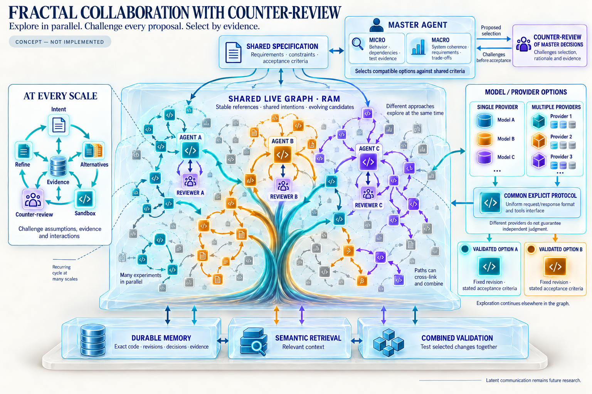

# RARMURE

**Fractal Multi-Agent Code Synthesis**

*From shared intent to tested software.*

Status: **concept formalization only**. Created: **2026-10-07**.

RARMURE is a proposed environment in which agents explore, challenge, and mature software solutions inside a shared representation of a project. Exploration paths can fork recursively. Agents register their intentions, experiment in small sandboxes, and submit their proposals to counter-review. A master agent considers both local behavior and global coherence to select compatible options against human-defined requirements.

The central object is a **living graph of possibilities and evidence**: requirements, exact source code, stable references, dependencies, intentions, alternatives, disagreements, decisions, and test results.

Parallel workers explore alternatives through separate working views. Each role can use an authorized model/provider route, while complementary review panels challenge candidates and master selections. A bounded asynchronous scheduler coordinates these roles; supplier diversity and agent agreement remain distinct from evidence that requirements are met.

Only the master has direct agent read/write access to the canonical **present**. Concurrent work happens in virtual working views in RAM. A separate exploration graph tracks possible transformations several moves ahead, with scoped assessments and paths still to explore. A FUSE-style projection could expose a fixed candidate to a sandbox on demand; the master alone promotes a selected state as the next present.

The name of this project and directory is **RARMURE**. The working name is not an acronym.

This directory is the intended project repository for specifications and, later, code. The present stage contains intent and design documents only. A code tree will be introduced when there is a bounded, usable implementation to pursue. [RARMURE Vocabulary](GLOSSARY.md) governs terminology.

SHAPER's separation of purpose, execution, and workspace remains a design principle. Requirements, intent, decision rationale, and evidence should survive model changes so a future model can reassess an earlier realization. Improvement is established through comparison, not assumed from model age or reputation.

SHAPER OS is a conceptual inspiration, not a required software dependency. RARMURE can function independently by implementing its own explicit authority, revision, review, and validation contracts. Integration with SHAPER software or formal adoption of its governing corpus remains optional and separate.

Public references: [SHAPER OS V1.15](https://github.com/xavdp-pro/SHAPER-OS-V1.15) and [SHAPER Three Layers](https://github.com/xavdp-pro/shaper-three-layers). The [foundation study](SHAPER-FOUNDATIONS.md) identifies the specific revisions informing this design.

## Read the concept

| Document | Purpose |
| --- | --- |
| [Short explanation and detailed concept](PROJECT-EXPLANATION.md) | One continuous account of the concept, its rationale, open choices, and all 41 registered ideas |
| [Vision](VISION.md) | The living-tree image, mathematical breathing, and functional beauty |
| [Architecture](ARCHITECTURE.md) | RAM, durable storage, semantic retrieval, references, and materialization |
| [Agent cooperation](AGENT-COOPERATION.md) | Intentions, discussions, counter-review, master coordination, and providers |
| [Requirements and validation](REQUIREMENTS-AND-VALIDATION.md) | Trade-offs, sandbox evidence, acceptance, and a worked example |
| [Research and roadmap](RESEARCH-AND-ROADMAP.md) | Deferred research, open questions, and possible future experiments |
| [DeepSeek Harness plugin study](DEEPSEEK-HARNESS-PLUGIN-STUDY.md) | Inspected plugin authoring path, RARMURE integration points, and execution limitations |
| [Glossary](GLOSSARY.md) | Shared vocabulary |
| [Context and continuity](CONTEXT-AND-CONTINUITY.md) | How an existing conceptual framework can help collaboration |
| [SHAPER foundations](SHAPER-FOUNDATIONS.md) | Detailed design synthesis: context horizons, accountable coordination, evidence, and revisable learning |
| [Scope and coverage](SCOPE-AND-COVERAGE.md) | Concept inventory, delivery status, and unresolved boundaries |
| [Visuals](visuals/README.md) | Three concept illustrations and their interpretation limits |
| [Agent instructions](AGENTS.md) | Language, scope, and evidence rules for future work |

## The recurring cycle

**Intent → alternatives → experiment → counter-review → refinement → selection → combined validation.**

This cycle can recur at project, subsystem, function, and behavior levels. Exploration paths may fork or pause; candidate contributions may interact and form compositions. Several viable outcomes can coexist. A fixed, tested revision can be extracted while exploration continues elsewhere.

*Concept illustration, not an implemented interface or proof of execution. The documents define the intended validation flow; see the visual notes for diagram limitations.*

## Foundational commitments

1. Human requirements define the shared purpose and the acceptance criteria.
2. Stable object identities connect exact content, intentions, revisions, and evidence.
3. Agent presence is informative and non-exclusive; it does not reserve a file.
4. Concurrent exploration is supported; compatibility must still be established.
5. Counter-review applies to every working cycle, including master decisions.
6. Local and combined experiments test concrete, reproducible states.
7. Selection balances explicit constraints and preferences rather than an undefined notion of “best.”
8. Decisions and useful alternatives remain revisable when conditions change.

Users could request and compare performance-oriented, security-oriented, reliability-oriented, or other variants. Each variant must meet shared mandatory constraints, and comparisons must state their workload, threat model, environment, and evidence limits. See [requirements and validation](REQUIREMENTS-AND-VALIDATION.md).

## Current boundary

This folder contains English documentation and concept illustrations. It contains no application, model modification, database deployment, working sandbox, benchmark result, or generated software implementation. No technology stack or provider has been selected.

Internal model behavior changes and direct latent communication remain deferred research. The architecture should be discussable and eventually testable through ordinary agent interfaces without making that research a prerequisite.

Human conversation is in **French**. Project artifacts—including code, documentation, comments, tests, prompts, and commit messages—are in **English**.
